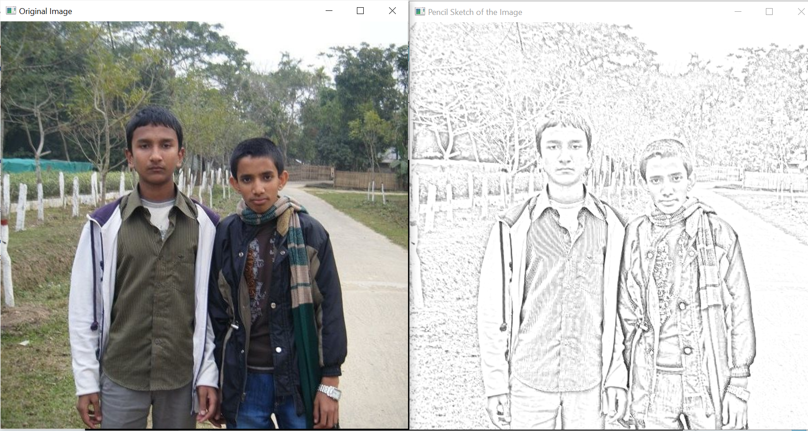

# Pencil-Sketch
Convert an image into a pencil sketch.

## Requirements
Python open cv
```
pip install opencv-python 
```
## Procedure
Rename the image file with "img.jpg"
```
python main.py
```
### To see the process of image modification uncomment all cv2.imshow code

##output

 
